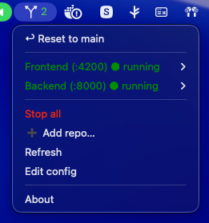

# treeswitch

<p align="center">
  
</p>

A macOS menu bar tool (SwiftBar plugin) for switching your local dev
environment between git worktrees. One icon, with a submenu per repo you
configure (for example a **Frontend** on `:4200` and a **Backend** on `:8000`),
each listing that repo's worktrees with a ✓ on the one that's currently running.
Click a worktree to kill that server and relaunch it from the selected worktree,
headless, with output going to a log.

```
⎇ 2                          ← icon + count of running servers
├─ ↩ Reset to main           ← one click: both repos back to their main worktree
├─ ─────────
├─ Frontend (:4200) ● running
│   ├─ ✓ fix/security #838 ● ↑2  —  frontend-repo   (✓ active · #PR · ● dirty · ↑ahead/↓behind)
│   ├─    main  —  frontend-repo
│   ├─ ─────────
│   ├─ Open http://localhost:4200
│   ├─ ↻ Restart current
│   ├─ Stop server
│   └─ Stream log
├─ Backend (:8000) ○ stopped
│   ├─    main  —  backend-repo
│   ├─    codex/integration-tests  —  backend-repo
│   ├─ ─────────
│   ├─ Open http://localhost:8000/docs
│   └─ Stream log
├─ ─────────
├─ Stop all
├─ ➕ Add repo…             ← native folder picker + a couple of prompts
├─ Refresh
└─ Edit config
```

## Requirements

- **macOS** — uses SwiftBar, `osascript`, `lsof`, and `stat -f`.
- **[SwiftBar](https://github.com/swiftbar/SwiftBar)** — `brew install --cask swiftbar`.
- **zsh** and **git** — both ship with macOS.
- **[GitHub CLI](https://cli.github.com) (`gh`)** — optional, only for the
  PR-number annotations (`gh auth login`). Works with github.com and GitHub
  Enterprise; the host is read from each repo's remote.

## How it works

- **Repos are independent** — switching one doesn't touch the others.
- **Worktrees** come from `git worktree list` on each repo (live, every 10s),
  annotated with a dirty marker (`●`) and ahead/behind counts vs upstream.
- **Switching** kills the running server, then launches the configured command
  from the selected worktree:
  - **Process-group lifecycle** — each server is launched in its own session via
    `setsid`, and its process-group id is recorded. Stopping does
    `kill -- -<pgid>`, so the whole tree dies (the `uv run`/reload parent, the
    uvicorn workers, `npm` → `ng serve` children) — not just the port holder.
    A server started *outside* the tool is still stopped cleanly by deriving its
    group from whoever holds the port.
  - **Detached + login shell** (`nohup … &!`, `zsh -l`) so it survives the click
    action exiting and inherits your PATH (brew / uv / node).
  - **`npm install`** runs first only if `node_modules` is missing (frontend).
  - **Log rotation** — the previous log is moved to `<repo>.log.prev`; each
    launch gets a fresh `<repo>.log`.
  - **Failure notification** — if the port never comes up within ~25s, a macOS
    notification fires and the menu shows `⚠ last start may have failed`.
- **Active ✓** = the worktree recorded in `state/<repo>.active` **and** the port
  is actually in use.
- **↩ Reset to main** — one click switches *every* repo to the worktree on its
  default branch (resolved from `origin/HEAD`, falling back to `main`/`master`)
  and (re)starts it. A repo with no worktree on its main branch is skipped with a
  notification.
- **PR numbers** — when a worktree's branch has an open GitHub PR, its number
  (e.g. `#838`, or `#838 draft`) is shown next to the branch. Powered by
  `gh pr list` per repo, cached under `cache/<repo>.prs` and refreshed in the
  background every ~2 minutes so the menu never blocks on the network. Works on
  GitHub Enterprise too (host is taken from each repo's remote). Toggle with
  `SHOW_PRS=0`.

## Layout

```
<this repo>/
├─ treeswitch.10s.sh   # the plugin + click-action dispatcher (single file)
├─ config.zsh      # template config
├─ install.sh      # seeds ~/.treeswitch and links the plugin
├─ uninstall.sh    # removes the plugin link (--purge also wipes ~/.treeswitch)
├─ smoke-test.sh   # non-destructive test (sandbox HOME + throwaway git repo)
└─ README.md

~/.treeswitch/  # runtime
├─ config.zsh       # YOUR config (edit this one)
├─ state/<repo>.active   # active worktree path
├─ state/<repo>.pgid     # launched process-group id
├─ cache/<repo>.prs      # branch→PR map (refreshed in background)
└─ logs/<repo>.log[.prev]
```

## Install

```sh
brew install --cask swiftbar              # if you don't have it
./install.sh ~/swiftbar-plugins           # link plugin + seed config
open "swiftbar://refreshallplugins"       # tell a running SwiftBar to reload
```

`install.sh` links the plugin into SwiftBar's plugin folder. Pass that folder as
the first argument (or set `$SWIFTBAR_PLUGIN_DIR`); it defaults to SwiftBar's
standard `~/Library/Application Support/SwiftBar/Plugins`. SwiftBar stores its
configured folder as a security-scoped bookmark, so it can't be auto-detected —
pass whatever you set under SwiftBar → Preferences → Plugin Folder.

Run `./smoke-test.sh` after changing the plugin — it checks syntax, clean menu
rendering, and the action dispatcher without touching your real repos or ports.

## Configure

**No config file to write by hand.** On first launch the menu shows a
**➕ Add your first repo…** item; the same **➕ Add repo…** lives in the footer
afterwards. It opens a native Finder **folder picker** for the repo, then prompts
for a name, a port, and the start command — and writes the config block for you.
The repo is validated as a real git checkout before it's added.

Prefer editing by hand? Open `~/.treeswitch/config.zsh` (the menu's **Edit
config** opens it). Each repo is a key in `REPO_KEYS` with matching entries in
the arrays:

| field         | meaning                                              |
|---------------|------------------------------------------------------|
| `LABEL`       | submenu title                                        |
| `REPO`        | path to the repo whose worktrees are listed          |
| `PORT`        | port to free before (re)starting                     |
| `CMD`         | command to launch the server                         |
| `WORKDIR`     | subdir of the worktree to run `CMD` from (`.` = root)|
| `NPM_INSTALL` | `1` to `npm install` when `node_modules` is missing  |
| `OPEN_URL`    | URL for the "Open …" item (default `localhost:PORT`) |

Globals: `CONFIRM_KILL=1` adds a confirm dialog before killing a running server;
`SHOW_PRS=0` turns off the GitHub PR-number annotations.

Add a third repo by appending its key to `REPO_KEYS` and filling in the arrays.
No code changes needed.

## Notes

- The plugin is symlinked, so edits to `treeswitch.10s.sh` here take effect on the
  next refresh. Config is *copied* on first install so reinstalling won't clobber
  your edits.
- **Stream log** runs `tail -F` in Terminal.

## License

[MIT](LICENSE) © Sindre Johannessen
